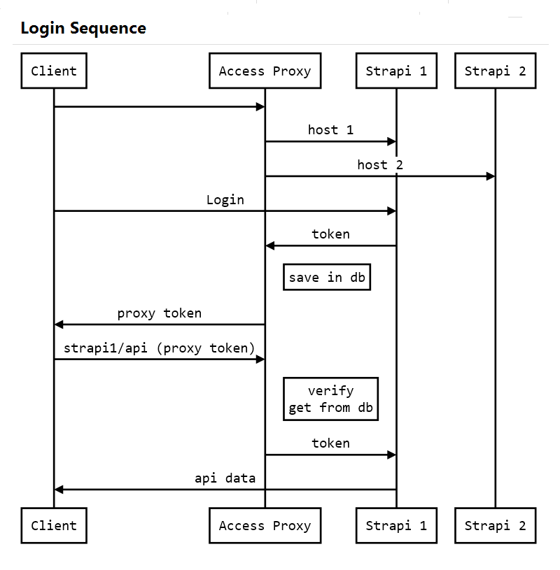

# WebAccess Strapi Plugin

Strapi access management based on JWT.

### Motivation

Strapi does not offer access management nor does it have to offer because the needs can be very different from case to case. Moreover, we can have multiple Strapi applications installed which would mean that each application manages its access separately. That is why there was a need to be able to control access centrally.

### Installation

WebAccess Strapi is a plugin of the broader project [WebAccess](https://github.com/SorinGFS/webaccess). 

```shell
npm run action install webaccess-proxy -- -p strapi
```

**Note:** optionally an older version can be installed by adding parameter `-v 1.2.3`

<details>
<summary>Remove an installed plugin: <em>(Click to expand)</em></summary>

```shell
npm run action uninstall webaccess-proxy -- -p strapi
```

</details>

### How it works

By default on login Strapi responds with a json web token in the response body. WebAccess is filtering the token and save it in the database, and replaces that token with own token based on the payload of the Strapi token. From this point on WebAccess takes the access management responsability. The Strapi token is valid one month. WebAccess can manage the token validation separately for each host. For example, if the host is configured to expire the token in 30 minutes `(default)` if in this interval the user use the token validity is extended to the next 30 minutes (this is sliding expiration used by default). If the token expires user has to re-login into Strapi app. If is desired to let token to be valid the entire browser session the frontend framework must use the token to ping WebAccess within it's validity interval.



### Some usage ideas

#### Basic usage (my current case)

-   use Strapi as authentication provider and as a keeper for secure user data
-   add a new `TEXT` field in Strapi User Content Type named `audience` to hold the domain names that user has access to
-   use WebAccess to manage the access to that Strapi db

#### Separate the admin channel from the regular user channel

-   You may block admin routes in downstream server and stil have centralized access on localhost or local network through this proxy.

#### Multiple Strapi apps, and another Strapi app for central user management

-   configure the first basic scenario
-   configure your other Strai apps with public data only. This way those apps can perform faster, can be placed on other server, can use load balancer, and so on. Take advantage from the fact that less than 10% of requests goes to secure user data.

#### External api connections

-   Use this proxy to perform external api requests in the backend instead of frontend, it increases the security.

### License

[MIT](LICENSE)
